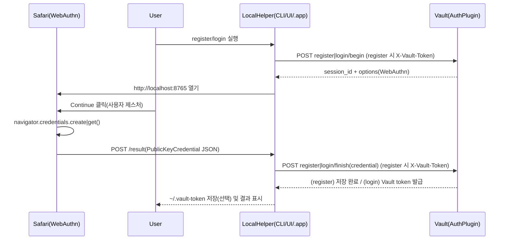

# vault-plugin-auth-mac-passkey

영문 문서(English): [`README.md`](./README.md)

macOS Touch ID 기반 Passkey(WebAuthn)로 Vault 토큰을 발급하는 Vault Auth method 플러그인입니다.

이 플러그인은 **macOS에서 동작하는 로컬 헬퍼(LocalHelper)** 와 함께 사용하는 것을 전제로 합니다. (Vault 서버는 WebAuthn 검증과 토큰 발급을 담당하고, Touch ID/Passkey “실행”은 사용자 단말에서 이뤄집니다.)

## Vault 경로(요약)

Auth method를 `auth/passkey/`로 enable 했다고 가정하면:

- `auth/passkey/config`: WebAuthn 설정(`rp_id`, `allowed_origins`, ...)
- `auth/passkey/role/<name>`: 토큰 policy/TTL 및 userHandle 검증 규칙
- `auth/passkey/register/begin`, `auth/passkey/register/finish`: Passkey 등록(enrollment)
- `auth/passkey/login/begin`, `auth/passkey/login/finish`: 로그인(=Vault 토큰 발급)

## 요구사항

- 플러그인을 사용할 수 있는 Vault
- (권장) Vault의 HTTPS 엔드포인트(WebAuthn 검증을 위해)
- 운영 환경에서는 Vault 접근에 맞는 **RP ID(DNS 이름)** 및 허용 **Origin** 목록을 명시하는 것이 좋습니다. 로컬 번들 헬퍼만 쓸 때는 설정을 생략해도 기본값이 적용됩니다.
- macOS 로컬 헬퍼(LocalHelper)
  - 이 저장소에는 WKWebView 기반 헬퍼가 포함되어 있습니다: `localhelper/vault-login-passkey-macos`
  - 설정 UI가 포함된 macOS `.app`도 포함되어 있습니다: `localhelper/vault-login-passkey-macos-app` (Safari로 WebAuthn 수행)

## 워크플로

이 플러그인은 **Passkey(WebAuthn) 검증과 토큰 발급은 Vault(auth plugin)가 담당**하고, **Passkey “승인(지문/Face ID 등)”은 사용자 단말(브라우저/로컬 헬퍼)** 에서 수행합니다.



## API

모든 엔드포인트는 마운트 경로 하위에 있습니다. (예: `auth/passkey/`)

- `POST register/begin` (**`X-Vault-Token` 필수**, 토큰에 Identity **EntityID**가 있어야 함)
  - 선택 `user_name`: WebAuthn 표시 이름(미입력 시 파생된 principal 문자열)
  - 선택 `user_handle`: 넣은 경우 **파생된 principal과 동일**해야 하며, 그렇지 않으면 거부
  - passkey principal: entity **name**이 비어 있지 않으면 그 이름, 비어 있으면 **entity id** 문자열 (클라이언트가 임의 subject 지정 불가)
  - WebAuthn `user.id`는 항상 **SHA-256(UTF-8 principal)** 32바이트이며, Vault `user_handle`은 문자열 principal 그대로 사용
  - 응답: `session_id`, `options` (WebAuthn `PublicKeyCredentialCreationOptions`)
- `POST register/finish` (`session_id`, `credential`, **`X-Vault-Token`** — begin과 동일한 신원)
  - `credential`: 브라우저 `PublicKeyCredential` 응답(JSON 바이트)을 base64url로 인코딩한 값
  - 성공 시: credential을 저장하고, 가능하면 등록 토큰의 **canonical entity**에 이 auth mount용 **identity entity-alias**를 (멱등으로) 붙임. alias **이름**은 entity id·mount accessor로부터 **결정적으로** 도출된 `passkey_` + 8자리 16진이며, WebAuthn·저장용 **principal**인 `user_handle`(entity 이름 또는 id)과는 별개입니다. 이전 버전처럼 잘못 붙은 alias(예: entity 이름과 동일)가 있으면 삭제 후 위 이름으로 다시 붙입니다. `ForwardGenericRequest`가 없으면 등록은 성공하고 **경고**만 붙을 수 있으나, 로그인 응답의 `Auth.Alias.Name`은 동일 규칙의 `passkey_*`를 써서 동일 entity에 매핑됩니다.
- `POST login/begin` (`role`, `user_handle`)
  - 응답: `session_id`, `options` (WebAuthn `PublicKeyCredentialRequestOptions`)
- `POST login/finish` (`session_id`, `credential`)
  - 성공 시 Vault 토큰 발급; identity alias **Name**은 entity id·mount accessor로 도출된 `passkey_xxxxxxxx`(등록 시 만든 것과 동일)이며, 메타데이터에 `user_handle`(principal)이 실림

## 설정

### config (`auth/passkey/config`)

| 항목 | 필수 | 설명 | 예시 |
|---|---:|---|---|
| `rp_id` | X | 비어 있으면 `localhost`. 실제 서비스 도메인을 쓰는 경우에는 반드시 해당 DNS 이름(예: `vault.example.com`)을 지정하세요. | `localhost` |
| `allowed_origins` | X | 비어 있고 `rp_id`가 `localhost` 또는 `127.0.0.1`이면 번들 헬퍼용으로 `http://localhost:8765`, `http://127.0.0.1:8765`가 기본 적용됩니다. 그 외 `rp_id`에서는 **반드시** 허용 origin을 나열해야 합니다. | `https://vault.example.com` |
| `allowed_user_handle_regex` | X | principal이 **entity name**일 때만 검증(등록/로그인). principal이 **entity id**인 경우(이름 없음)에는 적용하지 않음 | `^[a-z0-9_.-]+$` |
| `challenge_ttl` | X | 챌린지 유효시간(기본 `2m`) | `2m` |

### role (`auth/passkey/role/<name>`)

| 항목 | 필수 | 설명 | 예시 |
|---|---:|---|---|
| `policies` | X | 발급 토큰에 붙일 정책 | `default` |
| `ttl` | X | 발급 토큰 TTL | `1h` |
| `max_ttl` | X | 발급 토큰 Max TTL | `24h` |
| `allowed_user_handle_regex` | X | role 단위 `user_handle` 검증 정규식 | `^gs\\.lee$` |

## Vault에 설치/활성화

### 빌드

플러그인 빌드:

```bash
cd plugins/vault-plugin-auth-mac-passkey
make build
```

### 등록 및 활성화(예시)

`vault-plugin-secrets-machine` README와 동일한 형태로, Vault dev 모드에서 빠르게 확인할 수 있는 예시입니다.

1) (예시) dev 모드 Vault 실행 시 플러그인 디렉터리 지정:

```bash
vault server -dev \
  -dev-root-token-id=root \
  -dev-listen-address=0.0.0.0:8200 \
  -dev-plugin-dir=./dist
```

2) 플러그인 바이너리를 `dist/`에 준비하고 SHA256 계산:

```bash
PLUGIN=$(realpath ./dist/vault-plugin-auth-mac-passkey)
SHA256=$(shasum -a 256 "$PLUGIN" | awk '{print $1}')
export VAULT_TOKEN=root
export VAULT_ADDR=http://localhost:8200
```

3) 플러그인 등록 및 auth method enable:

```bash
vault plugin register -sha256="$SHA256" -command="vault-plugin-auth-mac-passkey" auth vault-plugin-auth-mac-passkey
vault auth enable -path=passkey -plugin-name=vault-plugin-auth-mac-passkey plugin
```

> 참고: Vault 내장 auth method와 달리, 외부 플러그인은 `-plugin-name ... plugin` 형태로 enable 합니다.

### WebAuthn 설정 및 role

WebAuthn 설정(로컬 번들 헬퍼만 사용할 때는 `rp_id` / `allowed_origins` 생략 가능):

```bash
# 최소 예: 기본 RP ID(localhost) + 기본 origin(8765) + 챌린지 TTL
vault write auth/passkey/config challenge_ttl="2m"
```

명시적으로 적을 때(운영·커스텀 origin 등):

```bash
vault write auth/passkey/config \
  rp_id="localhost" \
  allowed_origins="http://localhost:8765,http://127.0.0.1:8765" \
  challenge_ttl="2m"
```

`vault read auth/passkey/config`에는 실제 적용 값과 함께 `rp_id_uses_default`, `allowed_origins_use_localhost_defaults` 플래그가 포함될 수 있습니다(저장소에 값이 비어 있을 때 기본이 쓰인 경우).

role 생성:

```bash
vault write auth/passkey/role/default \
  policies="default" \
  ttl="1h" \
  max_ttl="24h"
```

### 등록에 쓰는 토큰의 ACL

`register/begin`·`register/finish`는 인증이 필요한 Vault API입니다. 등록에 사용하는 클라이언트 토큰은 해당 경로 호출이 허용되어야 합니다. 내장 **`default`** 정책만으로는 커스텀 플러그인 경로가 열려 있지 않은 경우가 많아, 예를 들어 아래가 필요할 수 있습니다.

```hcl
path "auth/passkey/register/*" {
  capabilities = ["update", "create"]
}
```

`passkey` 같은 이름으로 정책을 쓴 뒤, 등록에 쓸 userpass 사용자 등에 `policies=default,passkey`처럼 붙입니다. 마운트 경로가 다르면 `auth/passkey` 부분을 맞추세요.

### 부트스트랩: entity + 1차 로그인 후 passkey 등록

Passkey **등록**은 Vault 토큰에 Identity **EntityID**가 있을 때만 허용됩니다. 일반적인 흐름은 다음과 같습니다.

1. Identity **entity**를 만들거나 기존 entity를 사용합니다 (예: 이름 `alice`).
2. **userpass** 등으로 로그인해, 해당 entity에 매핑된 토큰을 발급받습니다.
3. 그 토큰을 **`X-Vault-Token`**으로 두고 `register/begin`·`register/finish`를 호출합니다. 플러그인은 entity **이름**(또는 id)을 WebAuthn principal·`user_handle`로 쓰고, Vault가 지원하면 해당 entity에 **passkey mount entity-alias**를 붙입니다(alias 이름은 entity·mount 기준으로 고정되는 `passkey_` + 8자리 16진).

**로그인**(`login/*`)은 비인증으로 유지되며, 사용자가 등록 시와 같은 **principal**(entity 이름 또는 그렇게 등록한 entity id)을 `user_handle`로 넣습니다. macOS 헬퍼는 Vault 토큰으로 `auth/token/lookup-self`와(정책이 허용하면) `identity/entity/id/...`를 호출해 자동으로 채울 수 있습니다.

## 빠른 시작

1) macOS 로컬 헬퍼 빌드/실행:

```bash
cd localhelper/vault-login-passkey-macos
swift build -c release
.build/release/vault-login-passkey ui
```

2) 화면에서 아래 값을 입력:

- Vault address: 예시 - `https://vault.example.com`
- Mount path: `auth/passkey`
- **Vault 토큰**: **등록** 시 필수. **로그인** 시 선택 — 있으면(필드·`VAULT_TOKEN`·`~/.vault-token`) lookup-self 및 가능 시 identity 조회로 `user_handle` 자동 결정
- **user_handle(로그인)**: 선택; 비어 있고 토큰이 있으면 헬퍼가 principal을 결정
- **표시 이름**: 등록 시 WebAuthn 표시용(선택)
- **Role**: 로그인 시 사용(예: `default`)

**`~/.vault-token`이 아직 없을 때(처음 테스트)**  
Passkey **등록**에는 Identity **EntityID**가 붙은 Vault 토큰이 필요합니다. 로컬에서 가장 단순한 방법은 **userpass**로 샘플 사용자를 만들고, 그 토큰을 `~/.vault-token`에 넣는 것입니다.

아래는 **개발/실험용** 예시입니다(`password=demo` 등). 실제 환경에서는 강한 비밀번호와 최소 권한 정책을 쓰세요.

```bash
export VAULT_ADDR=http://127.0.0.1:8200
# dev 모드이거나 관리용으로 이미 설정한 토큰
export VAULT_TOKEN=...   # 예: dev 루트 토큰

# userpass 활성화(이미 켜져 있으면 에러 나도 무시 가능)
vault auth enable userpass 2>/dev/null || true

# 등록 API 호출을 허용하는 정책(위 「등록에 쓰는 토큰의 ACL」과 동일)
vault policy write passkey - <<EOF
path "auth/passkey/register/*" {
  capabilities = ["update", "create"]
}
EOF

# 샘플 사용자: 사용자명 demo, 비밀번호 demo
vault write auth/userpass/users/demo password=demo policies=default,passkey

# 로그인 토큰만 받아서 ~/.vault-token에 저장(끝에 개행이 붙지 않도록 정리)
vault login -method=userpass username=demo password=demo

cat ~/.vault-token

# 환경 변수 토큰을 끄고, 파일 토큰만으로 동작하는지 확인
unset VAULT_TOKEN
vault status
vault token lookup
```

`vault token lookup`에서 **`entity_id`**가 비어 있지 않아야 합니다(최근 Vault는 userpass 로그인 시 entity를 자동으로 붙이는 경우가 많음). 비어 있으면 **「부트스트랩: entity + 1차 로그인 후 passkey 등록」**을 따르세요.

헬퍼는 등록용 토큰을 다음 순서로 고릅니다: **Vault 토큰 필드(비어 있지 않음) → `VAULT_TOKEN` → `~/.vault-token`**. UI에 붙여 넣은 토큰이 파일보다 우선합니다. Finder에서 연 GUI 앱은 셸의 **`VAULT_TOKEN`을 보통 물려받지 않습니다.**

3) **Register passkey** 후 **Login**

성공하면 헬퍼가 `~/.vault-token`을 **패스키 로그인으로 받은 토큰으로 덮어쓰므로**, 이후 `vault status`는 새 토큰 기준으로 동작해야 합니다.

### macOS `.app` 헬퍼(설정 UI 포함, 선택)

CLI/UI 바이너리 대신, 설정 UI가 포함된 `.app`을 사용할 수도 있습니다.

```bash
cd localhelper/vault-login-passkey-macos-app
chmod +x build-app.sh
./build-app.sh
open "./dist/VaultLoginPasskey.app"
```

### CLI 헬퍼(선택)

UI 없이도 실행할 수 있습니다(단, Passkey “승인”을 위해 Safari는 열립니다).

```bash
# 등록 (토큰: VAULT_TOKEN, ~/.vault-token, 또는 --vault-token)
.build/release/vault-login-passkey cli register \
  --vault-addr http://localhost:8200 \
  --mount-path auth/passkey

# 로그인(= ~/.vault-token 저장); user-handle = entity name
.build/release/vault-login-passkey cli login \
  --vault-addr http://localhost:8200 \
  --mount-path auth/passkey \
  --user-handle my-entity-name \
  --role default
```

## 보안/운영 주의사항

- **외부 IdP 없음**: Passkey(WebAuthn) 서명은 사용자 단말에서 생성되고, Vault auth 플러그인이 이를 검증해 토큰을 발급합니다.
- **등록은 EntityID가 있는 토큰 필요**: `register/*`는 인증 필수이며, passkey principal은 토큰의 **entity name**입니다(클라이언트가 임의로 바꿀 수 없음). 같은 토큰에 `auth/<마운트>/register/*` ACL이 있어야 합니다(**「등록에 쓰는 토큰의 ACL」**).
- **등록 시 entity-alias(가능할 때만)**: Vault가 `ForwardGenericRequest`를 주면 `register/finish`에서 멱등으로 **entity-alias**를 만듦(이름은 `passkey_`+8hex, entity id·mount accessor로 결정적, `canonical_id`는 등록 주체 entity). 같은 mount에 잘못된 이름의 기존 alias가 있으면 삭제 후 교체합니다. 없으면 등록은 성공하고 경고만 나갈 수 있으나, 로그인 시에도 동일 `passkey_*` **Alias.Name**으로 entity에 붙습니다.
- **로그인 시 `user_handle`**: 등록 시 쓴 **principal**(entity 이름 또는 id)과 같아야 합니다. 이름이 비어 있어 id로 등록한 경우 id를 쓰거나, 헬퍼의 토큰 기반 자동 결정을 사용하세요.
- **RP ID / Origin 일치**: `rp_id`와 `allowed_origins`가 배포 환경과 정확히 일치해야 합니다(불일치 시 검증 실패).
- **Challenge TTL**: 기본은 짧습니다. 승인 시간이 길어 자주 만료되면 `challenge_ttl`을 늘리세요.

## Demo

