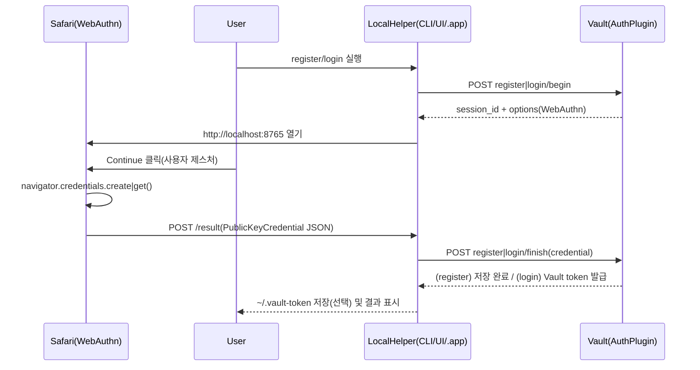

# vault-plugin-auth-mac-passkey

영문 문서(English): [`README.md`](./README.md)

macOS Touch ID 기반 Passkey(WebAuthn)로 Vault 토큰을 발급하는 Vault Auth method 플러그인입니다.

이 플러그인은 **macOS에서 동작하는 로컬 헬퍼(LocalHelper)** 와 함께 사용하는 것을 전제로 합니다. (Vault 서버는 WebAuthn 검증과 토큰 발급을 담당하고, Touch ID/Passkey “실행”은 사용자 단말에서 이뤄집니다.)

## Vault 경로(요약)

Auth method를 `auth/passkey/`로 enable 했다고 가정하면:

- `auth/passkey/config`: WebAuthn 설정(`rp_id`, `allowed_origins`, ...)
- `auth/passkey/role/<name>`: 토큰 policy/TTL 및 userHandle 검증 규칙
- `auth/passkey/register/begin`, `auth/passkey/register/finish`: Passkey 등록(enrollment)
- `auth/passkey/login/begin`, `auth/passkey/login/finish`: 로그인(=Vault 토큰 발급)

## 요구사항

- 플러그인을 사용할 수 있는 Vault
- (권장) Vault의 HTTPS 엔드포인트(WebAuthn 검증을 위해)
- 안정적인 **RP ID(DNS 이름)** 및 허용 **Origin** 목록
- macOS 로컬 헬퍼(LocalHelper)
  - 이 저장소에는 WKWebView 기반 헬퍼가 포함되어 있습니다: `localhelper/vault-login-passkey-macos`
  - 설정 UI가 포함된 macOS `.app`도 포함되어 있습니다: `localhelper/vault-login-passkey-macos-app` (Safari로 WebAuthn 수행)

## 워크플로

이 플러그인은 **Passkey(WebAuthn) 검증과 토큰 발급은 Vault(auth plugin)가 담당**하고, **Passkey “승인(지문/Face ID 등)”은 사용자 단말(브라우저/로컬 헬퍼)** 에서 수행합니다.




## API

모든 엔드포인트는 마운트 경로 하위에 있습니다. (예: `auth/passkey/`)

- `POST register/begin` (`user_handle`, `user_name` 선택)
  - 응답: `session_id`, `options` (WebAuthn `PublicKeyCredentialCreationOptions`)
- `POST register/finish` (`session_id`, `credential`)
  - `credential`: 브라우저 `PublicKeyCredential` 응답(JSON 바이트)을 base64url로 인코딩한 값
- `POST login/begin` (`role`, `user_handle`)
  - 응답: `session_id`, `options` (WebAuthn `PublicKeyCredentialRequestOptions`)
- `POST login/finish` (`session_id`, `credential`)
  - 성공 시 Vault 토큰 발급 (`identity alias Name = user_handle`)

## 설정

### config (`auth/passkey/config`)

| 항목 | 필수 | 설명 | 예시 |
|---|---:|---|---|
| `rp_id` | O | WebAuthn RP ID | `localhost` |
| `allowed_origins` | O | WebAuthn 검증에 허용할 origin 목록 | `http://localhost:8765` |
| `allowed_user_handle_regex` | X | 전역 `user_handle` 검증 정규식(등록/로그인 모두 적용) | `^[a-z0-9_.-]+$` |
| `challenge_ttl` | X | 챌린지 유효시간(기본 `2m`) | `2m` |

### role (`auth/passkey/role/<name>`)

| 항목 | 필수 | 설명 | 예시 |
|---|---:|---|---|
| `policies` | X | 발급 토큰에 붙일 정책 | `default` |
| `ttl` | X | 발급 토큰 TTL | `1h` |
| `max_ttl` | X | 발급 토큰 Max TTL | `24h` |
| `allowed_user_handle_regex` | X | role 단위 `user_handle` 검증 정규식 | `^gs\\.lee$` |

## Vault에 설치/활성화

### 빌드

플러그인 빌드:

```bash
cd plugins/vault-plugin-auth-mac-passkey
make build
```

## 등록 및 활성화(예시)

`vault-plugin-secrets-machine` README와 동일한 형태로, Vault dev 모드에서 빠르게 확인할 수 있는 예시입니다.

1) (예시) dev 모드 Vault 실행 시 플러그인 디렉터리 지정:

```bash
vault server -dev \
  -dev-root-token-id=root \
  -dev-listen-address=0.0.0.0:8200 \
  -dev-plugin-dir=./dist
```

2) 플러그인 바이너리를 `dist/`에 준비하고 SHA256 계산:

```bash
PLUGIN=$(realpath ./dist/vault-plugin-auth-mac-passkey)
SHA256=$(shasum -a 256 "$PLUGIN" | awk '{print $1}')
export VAULT_TOKEN=root
export VAULT_ADDR=http://localhost:8200
```

3) 플러그인 등록 및 auth method enable:

```bash
vault plugin register -sha256="$SHA256" -command="vault-plugin-auth-mac-passkey" auth vault-plugin-auth-mac-passkey
vault auth enable -path=passkey -plugin-name=vault-plugin-auth-mac-passkey plugin
```

> 참고: Vault 내장 auth method와 달리, 외부 플러그인은 `-plugin-name ... plugin` 형태로 enable 합니다.

### Register & enable (example)

WebAuthn 설정:

```bash
vault write auth/passkey/config \
  rp_id="localhost" \
  allowed_origins="http://localhost:8765" \
  challenge_ttl="2m"
```

role 생성:

```bash
vault write auth/passkey/role/default \
  policies="default" \
  ttl="1h" \
  max_ttl="24h"
```

## 빠른 시작(끝까지 한 번에)

1) macOS 로컬 헬퍼 빌드/실행:

```bash
cd localhelper/vault-login-passkey-macos
swift build -c release
.build/release/vault-login-passkey ui
```

2) 화면에서 아래 값을 입력:

- Vault address: 예시 - `https://vault.example.com`
- Mount path: `auth/passkey`
- User handle: 불변 식별자(권장: 사번/계정명. 이메일은 변경될 수 있어 비권장)
- Role: Policy가 아닌 role 이름 (예시 - `default`)

3) **Register passkey** 후 **Login** 클릭

성공하면 헬퍼가 `~/.vault-token`에 토큰을 저장하므로 `vault status`가 바로 동작해야 합니다.

### macOS `.app` 헬퍼(설정 UI 포함, 선택)

CLI/UI 바이너리 대신, 설정 UI가 포함된 `.app`을 사용할 수도 있습니다.

```bash
cd localhelper/vault-login-passkey-macos-app
chmod +x build-app.sh
./build-app.sh
open "./dist/VaultLoginPasskey.app"
```

### CLI 헬퍼(선택)

UI 없이도 실행할 수 있습니다(단, Passkey “승인”을 위해 Safari는 열립니다).

```bash
# 등록
.build/release/vault-login-passkey cli register \
  --vault-addr http://localhost:8200 \
  --mount-path auth/passkey \
  --user-handle gs.lee

# 로그인(= ~/.vault-token 저장)
.build/release/vault-login-passkey cli login \
  --vault-addr http://localhost:8200 \
  --mount-path auth/passkey \
  --user-handle gs.lee \
  --role default
```

### Safari에 \"Continue\" 버튼이 뜨는 이유

WebAuthn(`navigator.credentials.create()` / `navigator.credentials.get()`)은 브라우저/웹킷 정책상 **사용자 제스처(user gesture)** 이후에만 호출이 허용되는 경우가 많습니다.\n+자동 실행을 시도하면 `NotAllowedError`로 막히는 등 동작이 불안정해질 수 있어, 안정성을 위해 한 번의 클릭(**Continue**)으로 제스처를 확보한 뒤 Passkey를 트리거합니다.

## 보안/운영 주의사항

- **외부 IdP 없음**: Passkey(WebAuthn) 서명은 사용자 단말에서 생성되고, Vault auth 플러그인이 이를 검증해 토큰을 발급합니다.
- **`user_handle`가 계정 키**: 플러그인은 `identity alias Name=user_handle`로 매핑합니다. 변경되지 않는 값을 쓰세요.
- **RP ID / Origin 일치**: `rp_id`와 `allowed_origins`가 배포 환경과 정확히 일치해야 합니다(불일치 시 검증 실패).
- **Challenge TTL**: 기본은 짧습니다. 승인 시간이 길어 자주 만료되면 `challenge_ttl`을 늘리세요.

## 트러블슈팅

- **`passkey auth is not configured`**: 먼저 `auth/passkey/config`에 `rp_id`, `allowed_origins`를 써야 합니다.
- **`webauthn assertion failed` / `credential parse failed`**:
  - RP ID / Origin 불일치가 가장 흔한 원인입니다.
  - macOS/WebKit 버전에 따라 WKWebView의 WebAuthn 지원이 제한될 수 있습니다.
- **`no registered credentials for user_handle`**: 해당 `user_handle`로 먼저 등록(`register/*`)을 완료해야 합니다.

