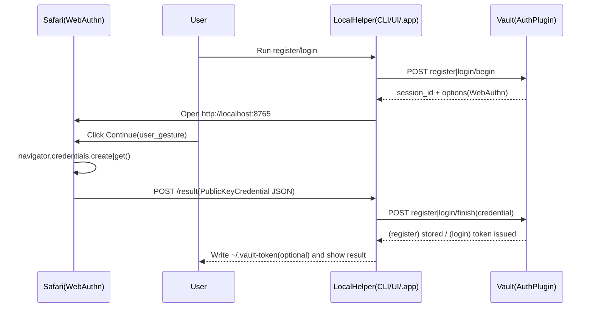

# vault-plugin-auth-mac-passkey

Korean documentation (한국어): [`README.ko.md`](./README.ko.md)

Vault auth method plugin that issues Vault tokens using WebAuthn passkeys (e.g. macOS Touch ID).

This plugin is designed to be used with a **local client helper** on macOS that performs the WebAuthn ceremonies and calls this auth method.

## Vault paths (high-level)

Assuming you enable the auth method at `auth/passkey/`:

- `auth/passkey/config`: WebAuthn configuration (`rp_id`, `allowed_origins`, ...)
- `auth/passkey/role/<name>`: token policies/TTLs and optional userHandle validation
- `auth/passkey/register/begin`, `auth/passkey/register/finish`: passkey enrollment
- `auth/passkey/login/begin`, `auth/passkey/login/finish`: login (issues Vault token)

## Requirements

- Vault with plugin support
- A working HTTPS endpoint for Vault (recommended for WebAuthn)
- A stable **RP ID** (DNS name) and browser **origin** list
- A macOS local helper. This repo includes one:
  - `localhelper/vault-login-passkey-macos` (WKWebView-based)
  - `localhelper/vault-login-passkey-macos-app` (macOS `.app` with settings UI; uses Safari for WebAuthn)

## Workflow

The auth plugin verifies WebAuthn assertions and issues Vault tokens, while the Passkey ceremony happens on the client (browser/local helper).



## API

All endpoints are under your mount path (example: `auth/passkey/`).

- `POST register/begin` with `user_handle`, optional `user_name`
  - returns: `session_id`, `options` (WebAuthn `PublicKeyCredentialCreationOptions`)
- `POST register/finish` with `session_id`, `credential`
  - `credential`: base64url-encoded JSON bytes of browser `PublicKeyCredential` response
- `POST login/begin` with `role`, `user_handle`
  - returns: `session_id`, `options` (WebAuthn `PublicKeyCredentialRequestOptions`)
- `POST login/finish` with `session_id`, `credential`
  - returns Vault `auth` with identity alias `Name=user_handle`

## Configuration

### config (`auth/passkey/config`)

| Field | Required | Description | Example |
|---|---:|---|---|
| `rp_id` | yes | WebAuthn RP ID | `localhost` |
| `allowed_origins` | yes | Allowed origins for WebAuthn verification | `http://localhost:8765` |
| `allowed_user_handle_regex` | no | Global `user_handle` validation regex (register + login) | `^[a-z0-9_.-]+$` |
| `challenge_ttl` | no | Challenge TTL (default `2m`) | `2m` |

### role (`auth/passkey/role/<name>`)

| Field | Required | Description | Example |
|---|---:|---|---|
| `policies` | no | Policies attached to issued tokens | `default` |
| `ttl` | no | Token TTL | `1h` |
| `max_ttl` | no | Token max TTL | `24h` |
| `allowed_user_handle_regex` | no | Role-level `user_handle` validation regex | `^gs\\.lee$` |

## Install / Enable in Vault

### Build

Build the plugin:

```bash
cd plugins/vault-plugin-auth-mac-passkey
make build
```

## Register & enable (example)

This mirrors the structure used in `vault-plugin-secrets-machine` so first-time users can follow an end-to-end setup quickly.

1) Run Vault in dev mode and point `-dev-plugin-dir` to a directory containing the plugin binary:

```bash
vault server -dev \
  -dev-root-token-id=root \
  -dev-listen-address=0.0.0.0:8200 \
  -dev-plugin-dir=./dist
```

2) Place the plugin binary under `dist/` and compute SHA256:

```bash
PLUGIN=$(realpath ./dist/vault-plugin-auth-mac-passkey)
SHA256=$(shasum -a 256 "$PLUGIN" | awk '{print $1}')
export VAULT_TOKEN=root
export VAULT_ADDR=http://localhost:8200
```

3) Register the plugin and enable the auth method:

```bash
vault plugin register -sha256="$SHA256" -command="vault-plugin-auth-mac-passkey" auth vault-plugin-auth-mac-passkey
vault auth enable -path=passkey -plugin-name=vault-plugin-auth-mac-passkey plugin
```

### Register & enable (example)

Configure WebAuthn:

```bash
vault write auth/passkey/config \
  rp_id="localhost" \
  allowed_origins="http://localhost:8765" \
  challenge_ttl="2m"
```

Create a role:

```bash
vault write auth/passkey/role/default \
  policies="default" \
  ttl="1h" \
  max_ttl="24h"
```

## Quickstart (end-to-end)

1) Build and run the macOS local helper:

```bash
cd localhelper/vault-login-passkey-macos
swift build -c release
.build/release/vault-login-passkey ui
```

2) Fill in the UI fields:

- Vault address: `https://vault.example.com`
- Mount path: `auth/passkey`
- User handle: a stable identifier (recommended: employeeId/username, not email)
- Role: `default`

3) Click **Register passkey**, then **Login**.

On success, the helper writes the Vault token to `~/.vault-token`, so `vault status` should work immediately.

### macOS `.app` helper (settings UI, optional)

You can also use the bundled `.app` helper with a settings UI:

```bash
cd localhelper/vault-login-passkey-macos-app
chmod +x build-app.sh
./build-app.sh
open "./dist/VaultLoginPasskey.app"
```

### CLI helper (optional)

You can also run the helper without its UI:

```bash
# Register
.build/release/vault-login-passkey cli register \
  --vault-addr http://localhost:8200 \
  --mount-path auth/passkey \
  --user-handle gs.lee

# Login (writes ~/.vault-token)
.build/release/vault-login-passkey cli login \
  --vault-addr http://localhost:8200 \
  --mount-path auth/passkey \
  --user-handle gs.lee \
  --role default
```

### Why does Safari show a \"Continue\" button?

WebAuthn calls (`navigator.credentials.create()` / `navigator.credentials.get()`) are commonly restricted to run only after a **user gesture**.\n+To keep the flow reliable across browser/WebKit versions, the helper page asks you to click **Continue** once before triggering Passkey.

## Security and operational notes

- **No external IdP**: WebAuthn ceremonies happen on the client, and Vault verifies assertions in the auth plugin.
- **`user_handle` is the identity key**: the plugin sets Vault identity alias `Name=user_handle`. Use a stable ID.
- **TLS/Origins**: make sure `rp_id` and `allowed_origins` match your deployment (mismatches cause verification failures).
- **Challenge TTL**: default is short. If users regularly time out while approving Touch ID, increase `challenge_ttl`.

## Troubleshooting

- **`passkey auth is not configured`**: write `auth/passkey/config` first (`rp_id`, `allowed_origins`).
- **`webauthn assertion failed` / `credential parse failed`**:
  - RP ID and Origin mismatch is the most common cause.
  - Ensure the local helper is allowed to run WebAuthn on your macOS/WebKit version.
- **`no registered credentials for user_handle`**: run `register/begin` + `register/finish` first for that `user_handle`.

