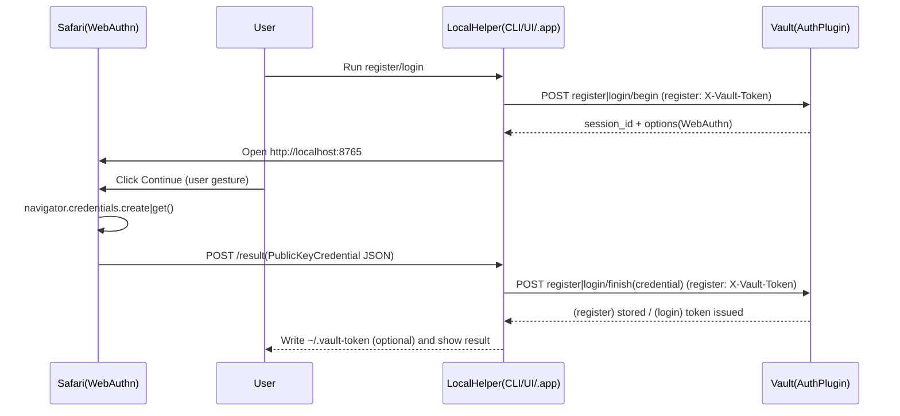

# vault-plugin-auth-mac-passkey

Korean documentation (한국어): [`README.ko.md`](./README.ko.md)

Vault auth method plugin that issues Vault tokens using WebAuthn passkeys (e.g. macOS Touch ID).

It is meant to be used together with a **local helper on macOS** (the Vault server performs WebAuthn verification and token issuance; Touch ID / Passkey approval runs on the user’s machine).

## Vault paths (high-level)

Assuming you enable the auth method at `auth/passkey/`:

- `auth/passkey/config`: WebAuthn configuration (`rp_id`, `allowed_origins`, ...)
- `auth/passkey/role/<name>`: token policies/TTLs and optional userHandle validation
- `auth/passkey/register/begin`, `auth/passkey/register/finish`: passkey enrollment
- `auth/passkey/login/begin`, `auth/passkey/login/finish`: login (issues Vault token)

## Requirements

- Vault with plugin support
- (Recommended) HTTPS for the Vault endpoint (for WebAuthn)
- In production, set a stable **RP ID** (DNS name) and allowed **Origin** list explicitly. For the bundled local helper only, you can omit them and the plugin applies localhost defaults.
- A macOS local helper. This repo includes:
  - `localhelper/vault-login-passkey-macos` (WKWebView-based helper)
  - `localhelper/vault-login-passkey-macos-app` (macOS `.app` with a settings UI; WebAuthn via Safari)

## Workflow

**Passkey (WebAuthn) verification and token issuance are done by Vault (the auth plugin)**; **Passkey approval (Touch ID / Face ID, etc.) runs on the user’s device** (browser / local helper).



## API

All endpoints are under your mount path (example: `auth/passkey/`).

- `POST register/begin` (**requires** `X-Vault-Token` with an identity **EntityID**)
  - optional `user_name` (WebAuthn display name; defaults to the derived passkey principal)
  - optional `user_handle`: if set, must equal the derived principal (otherwise rejected)
  - passkey principal is the entity **name** when non-empty; if the entity has **no name**, the principal is the **entity id** string (clients cannot pick a different subject)
  - WebAuthn `user.id` is always **SHA-256(UTF-8 principal)** (32 bytes); the string principal is still used as Vault `user_handle`
  - returns: `session_id`, `options` (WebAuthn `PublicKeyCredentialCreationOptions`)
- `POST register/finish` with `session_id`, `credential` (**same token** as begin; same EntityID as the session)
  - `credential`: base64url-encoded JSON bytes of browser `PublicKeyCredential` response
  - on success: stores the credential; **best-effort** attaches an **identity entity-alias** to the enrolling entity’s **canonical id** on this auth mount (idempotent). The alias **name** is deterministically `passkey_` plus 8 hex chars derived from the entity id and mount accessor (not the WebAuthn `user_handle`). Legacy aliases on that mount whose name equals the old principal (e.g. entity name) are removed and replaced. If `ForwardGenericRequest` is unavailable, enrollment can still succeed with a **warning**, but login responses still set `Auth.Alias.Name` to the same `passkey_*` pattern so tokens attach to the correct entity.
- `POST login/begin` with `role`, `user_handle`
  - returns: `session_id`, `options` (WebAuthn `PublicKeyCredentialRequestOptions`)
- `POST login/finish` with `session_id`, `credential`
  - returns Vault `auth` with identity alias **Name** set to the same deterministic `passkey_xxxxxxxx` as enrollment; **metadata** still carries `user_handle` (principal)

## Configuration

### config (`auth/passkey/config`)

| Field | Required | Description | Example |
|---|---:|---|---|
| `rp_id` | no | Defaults to `localhost` when empty. For a real deployment, set your DNS RP ID (e.g. `vault.example.com`). | `localhost` |
| `allowed_origins` | no | When empty and `rp_id` is `localhost` or `127.0.0.1`, defaults to `http://localhost:8765` and `http://127.0.0.1:8765` for the bundled helper. For any other `rp_id`, **you must** list allowed origins. | `https://vault.example.com` |
| `allowed_user_handle_regex` | no | Validates the passkey principal when it is the **entity name** (register + login). **Not applied** when the principal is the **entity id** (name empty). | `^[a-z0-9_.-]+$` |
| `challenge_ttl` | no | Challenge TTL (default `2m`) | `2m` |

### role (`auth/passkey/role/<name>`)

| Field | Required | Description | Example |
|---|---:|---|---|
| `policies` | no | Policies attached to issued tokens | `default` |
| `ttl` | no | Token TTL | `1h` |
| `max_ttl` | no | Token max TTL | `24h` |
| `allowed_user_handle_regex` | no | Role-level `user_handle` validation regex | `^gs\\.lee$` |

## Install / Enable in Vault

### Build

Build the plugin:

```bash
cd plugins/vault-plugin-auth-mac-passkey
make build
```

### Register & enable (example)

This mirrors the structure used in `vault-plugin-secrets-machine` so first-time users can follow an end-to-end setup quickly.

1) Run Vault in dev mode and point `-dev-plugin-dir` to a directory containing the plugin binary:

```bash
vault server -dev \
  -dev-root-token-id=root \
  -dev-listen-address=0.0.0.0:8200 \
  -dev-plugin-dir=./dist
```

2) Place the plugin binary under `dist/` and compute SHA256:

```bash
PLUGIN=$(realpath ./dist/vault-plugin-auth-mac-passkey)
SHA256=$(shasum -a 256 "$PLUGIN" | awk '{print $1}')
export VAULT_TOKEN=root
export VAULT_ADDR=http://localhost:8200
```

3) Register the plugin and enable the auth method:

```bash
vault plugin register -sha256="$SHA256" -command="vault-plugin-auth-mac-passkey" auth vault-plugin-auth-mac-passkey
vault auth enable -path=passkey -plugin-name=vault-plugin-auth-mac-passkey plugin
```

> External auth plugins use the `-plugin-name … plugin` form of `vault auth enable`, unlike built-in methods.

### WebAuthn configuration and role

Configure WebAuthn (for the bundled local helper you can omit `rp_id` and `allowed_origins`):

```bash
# Minimal: default RP ID + default helper origins + challenge TTL
vault write auth/passkey/config challenge_ttl="2m"
```

Explicit example:

```bash
vault write auth/passkey/config \
  rp_id="localhost" \
  allowed_origins="http://localhost:8765,http://127.0.0.1:8765" \
  challenge_ttl="2m"
```

`vault read auth/passkey/config` includes `rp_id_uses_default` and `allowed_origins_use_localhost_defaults` when the stored values were empty and defaults were applied.

Create a role:

```bash
vault write auth/passkey/role/default \
  policies="default" \
  ttl="1h" \
  max_ttl="24h"
```

### ACL: token used for `register/*`

`register/begin` and `register/finish` are authenticated Vault API calls. The enrolling client token must be allowed to invoke those paths. The built-in **`default`** policy typically does **not** include custom plugin routes, so you often need something like:

```hcl
path "auth/passkey/register/*" {
  capabilities = ["update", "create"]
}
```

Write it as a named policy (e.g. `passkey`) and attach it to the userpass user (or group) whose token you use for enrollment, e.g. `policies=default,passkey`. Adjust `auth/passkey` if your mount path differs.

### Bootstrap: entity + primary login, then passkey enrollment

Passkey registration is only allowed with a Vault token that already has an **identity entity** (non-empty `EntityID`). A typical flow:

1. Create an entity (or use an existing one), e.g. name `alice`.
2. Log in with **userpass** (or another method) so the token is tied to that entity.
3. Call `register/begin` and `register/finish` with **`X-Vault-Token`** set to that token. The plugin uses the entity **name** (or id) as the WebAuthn principal / `user_handle`, and when Vault supports it attaches a **passkey mount entity-alias** to that entity (deterministic `passkey_` + 8 hex chars from entity id + mount accessor).

**Login** (`login/*`) stays unauthenticated: the user supplies the same **principal** (entity name, or entity id if enrolled that way) as `user_handle`. The macOS helper can derive it from a Vault token via `auth/token/lookup-self` and, when permitted, `identity/entity/id/...` for the human-readable name.

## Quickstart (end-to-end)

1) Build and run the macOS local helper:

```bash
cd localhelper/vault-login-passkey-macos
swift build -c release
.build/release/vault-login-passkey ui
```

2) Fill in the UI fields:

- Vault address: for example `https://vault.example.com`
- Mount path: `auth/passkey`
- **Vault token**: required for **Register**; optional for **Login** — when present (field / `VAULT_TOKEN` / `~/.vault-token`), the helper can call **lookup-self** (and **identity/entity/id** if your policy allows) to resolve `user_handle` automatically.
- **user_handle** (login): optional; if left empty while a suitable token is available, the helper derives the principal for you.
- **Display name**: optional WebAuthn display name at registration.
- **Role**: used at login (e.g. `default`).

**If you do not have `~/.vault-token` yet (first-time testing)**  
Passkey **registration** needs a Vault token with an Identity **EntityID**. For local setups, the simplest path is to create a **userpass** user, log in, and store that token in `~/.vault-token`.

The following is a **dev / lab** example (`password=demo`, etc.). Use strong passwords and least-privilege policies in real environments.

```bash
export VAULT_ADDR=http://127.0.0.1:8200
# Dev mode or another admin token you already use
export VAULT_TOKEN=...   # e.g. dev root token

# Enable userpass (ignore errors if it is already enabled)
vault auth enable userpass 2>/dev/null || true

# Policy so the enrollment token may call register/begin and register/finish
vault policy write passkey - <<EOF
path "auth/passkey/register/*" {
  capabilities = ["update", "create"]
}
EOF

# Sample user: username demo, password demo
vault write auth/userpass/users/demo password=demo policies=default,passkey

# Issue a login token and write it to ~/.vault-token (strip trailing newlines)
vault login -method=userpass username=demo password=demo

cat ~/.vault-token

# Drop the env token and confirm the file token works
unset VAULT_TOKEN
vault status
vault token lookup
test -s ~/.vault-token && echo "~/.vault-token OK ($(wc -c < ~/.vault-token) bytes)"
```

Check `vault token lookup`: **`entity_id`** must be non-empty (recent Vault usually creates an entity on userpass login). If it is empty, follow **Bootstrap: entity + primary login, then passkey enrollment** above.

The helper resolves the registration token in this order: **non-empty Vault token field → `VAULT_TOKEN` → `~/.vault-token`**. A token pasted in the UI overrides the file. GUI apps launched from Finder often do **not** inherit shell `VAULT_TOKEN`.

3) Click **Register passkey**, then **Login**.

On success, the helper **overwrites `~/.vault-token` with the token from passkey login**, so `vault status` should then reflect that new token.

### macOS `.app` helper (settings UI, optional)

Instead of the CLI/UI binary, you can use the bundled `.app` helper with a settings UI:

```bash
cd localhelper/vault-login-passkey-macos-app
chmod +x build-app.sh
./build-app.sh
open "./dist/VaultLoginPasskey.app"
```

### CLI helper (optional)

You can run the helper without the WK UI (Safari still opens for Passkey approval):

```bash
# Register (token: VAULT_TOKEN, ~/.vault-token, or --vault-token)
.build/release/vault-login-passkey cli register \
  --vault-addr http://localhost:8200 \
  --mount-path auth/passkey

# Login (writes ~/.vault-token); user-handle = entity name
.build/release/vault-login-passkey cli login \
  --vault-addr http://localhost:8200 \
  --mount-path auth/passkey \
  --user-handle my-entity-name \
  --role default
```

## Security and operational notes

- **No external IdP**: WebAuthn assertions are created on the user’s device; the Vault auth plugin verifies them and issues tokens.
- **Enrollment requires a token with EntityID**: `register/*` is authenticated; the passkey principal is the **entity name** from that token (not a client-chosen subject). The same token also needs ACL coverage for `auth/<mount>/register/*` (see **ACL: token used for `register/*`**).
- **Identity alias at enrollment (best-effort)**: when Vault exposes `ForwardGenericRequest` to the plugin, `register/finish` creates (idempotently) an **entity-alias** on this auth mount named deterministic `passkey_`+8hex with `canonical_id` set to the enrolling entity; wrong legacy names on that mount are deleted first. Login always uses the same `passkey_*` **Alias.Name** when `EntityID` is known so Vault does not create a duplicate alias named after `user_handle`. If forwarding is unsupported, registration may warn, but login still uses the deterministic alias name.
- **`user_handle` at login**: must match the **principal** you enrolled with (entity **name** or **entity id** if you enrolled with an unnamed entity). Use the id in that case, or let the helper resolve the principal from a token when possible.
- **TLS/Origins**: make sure `rp_id` and `allowed_origins` match your deployment (mismatches cause verification failures).
- **Challenge TTL**: default is short. If users regularly time out while approving Touch ID, increase `challenge_ttl`.

## Troubleshooting

- **`token must be associated with an identity entity` (HTTP 400 on `register/begin`)**: The `X-Vault-Token` must have a non-empty identity `entity_id` (`vault token lookup`). Root tokens often have no entity. Use a userpass (or similar) token, and ensure the helper is not sending a different token (see Quickstart: token resolution order).
- **`permission denied` (HTTP 403 on `register/begin` or `register/finish`)**: Add `update`/`create` on `auth/<mount>/register/*` to that token’s policies; see **ACL: token used for `register/*`** above.
- **`passkey auth is not configured`**: write `auth/passkey/config` first (`rp_id`, `allowed_origins`).
- **`webauthn assertion failed` / `credential parse failed`**:
  - RP ID and Origin mismatch is the most common cause.
  - Ensure the local helper is allowed to run WebAuthn on your macOS/WebKit version.
- **`no registered credentials for user_handle`**: run `register/begin` + `register/finish` first for that `user_handle`.
- **Browser: “The length options.user.id must be between 1-64 bytes”**: The plugin always sets WebAuthn `user.id` to **SHA-256(principal)** (32 bytes); Vault still stores and looks up credentials by the string `user_handle`. The Safari helper normalizes `user.id` whether the JSON uses base64url strings or byte arrays. **Re-enroll** passkeys if you previously enrolled with an older plugin build.

## Demo

