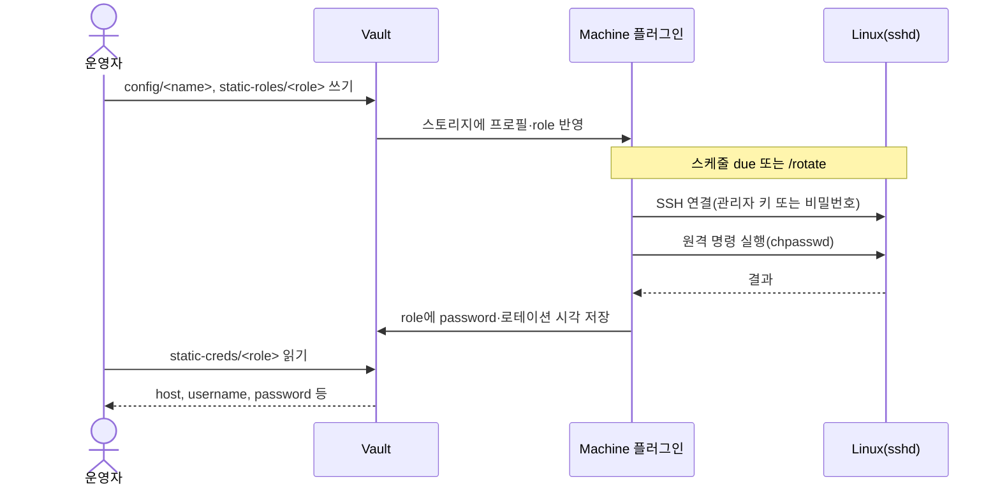
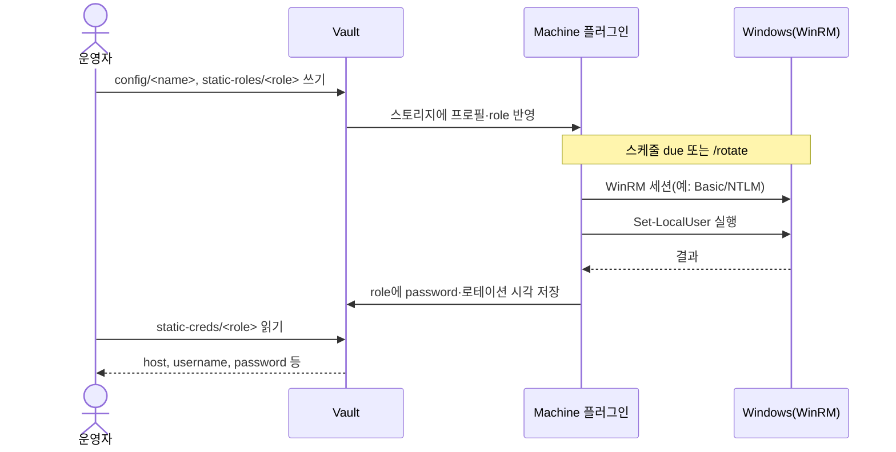

# vault-plugin-secrets-machine

English documentation (영문): [`README.md`](./README.md)

원격 머신의 **로컬 OS 계정 비밀번호를 저장하고 주기적으로 변경(로테이션)**하는 HashiCorp Vault **시크릿 엔진 플러그인**입니다.

- **Linux**: **SSH**로 접속하여 `chpasswd`로 비밀번호 변경
- **Windows**: **WinRM**으로 PowerShell `Set-LocalUser` 실행

**정적(static) role만** 지원합니다(Database 정적 role과 유사). 동적 사용자 생성/삭제 기반 “dynamic role”은 범위에서 제외합니다.

## Vault 경로(요약)

플러그인을 `machine/`으로 마운트했다고 가정하면:

- `machine/config`: (레거시) 엔진 기본값(포트 등)
- `machine/config/<name>`: **연결 프로필(Database 엔진 스타일 config)** – SSH/WinRM 선택 + 비밀번호 변경용 관리자(root credential) 설정
- `machine/static-roles/<name>`: 정적 role 정의(한 role = 한 host + 한 username)
- `machine/static-creds/<role>`: 현재 번들 읽기(host, username, password, 로테이션 메타데이터)

## 요구사항

- Go(플러그인 빌드)
- Vault(플러그인 지원)
- Vault 플러그인 프로세스에서 대상 호스트로의 네트워크 연결(SSH/WinRM)

### 지원 Linux 버전 및 SSH 옵션 고려사항

플러그인은 대상 호스트에 **SSH로 비대화형(non-interactive) 원격 명령**을 실행하고, `chpasswd`로 **로컬 `/etc/shadow` 기반 계정**의 비밀번호를 바꿉니다. 아래는 일반적인 호환 범위와 `sshd`/권한 측면에서의 고려사항입니다.

**지원 범위(일반화)**

- **배포판**: RHEL / Oracle Linux / Rocky / Alma **7 이상**, Ubuntu **18.04 LTS 이상**, Debian **9 이상**, SLES **12 이상** 등, **OpenSSH 서버(`sshd`)**와 **`shadow-utils`( `chpasswd` 제공)**가 있는 일반적인 서버용 Linux를 전제로 합니다.
- **아키텍처**: x86_64 / AArch64 등 Go 빌드 타깃과 무관하게, SSH·셸·`chpasswd`가 지원되어야 합니다.

**대상 호스트에 필요한 것**

- `chpasswd`가 실행 가능해야 합니다(보통 `shadow-utils` 패키지).
- 관리자 계정으로 **원격 세션에서 셸 명령 실행**이 가능해야 합니다(플러그인은 `ssh.Session.Run`으로 한 줄 파이프라인을 실행합니다).
- **관리자가 root가 아닌 경우**: 비밀번호 없는 sudo(`sudo -n`)로 `chpasswd`까지 도달 가능하거나, 연결 프로필에 `sudo_password`를 설정해 `sudo -S` 경로를 쓸 수 있어야 합니다. (코드상 기본은 `sudo -n bash -c '... chpasswd'`입니다.)
- **관리자가 root인 경우**: `sudo` 없이 `chpasswd`를 직접 호출합니다(`sudo_password` 불필요).
- 로테이션 대상 `username`은 **로컬 사용자( `/etc/passwd`·`/etc/shadow`에 존재)**여야 합니다. LDAP/NIS만 있고 로컬 항목이 없는 계정은 `chpasswd` 대상으로 부적합할 수 있습니다.

**SSH / `sshd` 옵션 관점**

- **포트**: 생략 시 SSH 기본 **22**(엔진 기본값·프로필·role 순으로 결정). 방화벽·보안 그룹에서 플러그인( Vault 실행 호스트 )→대상 **TCP 연결**이 열려 있어야 합니다.
- **관리자 인증**: `admin_private_key`(PEM) 또는 `admin_password`(SSH 비밀번호 인증) 중 하나가 필요합니다. 서버가 관리자에 대해 **키만 허용**하면 키를, **비밀번호만 허용**하면 비밀번호를 쓰세요.
- **알고리즘/키 형식**: Go `golang.org/x/crypto/ssh`로 연결합니다. 매우 오래된 `ssh-rsa` 호스트 키만 허용하는 등 극단적 제한이 있으면 협상 실패할 수 있습니다(서버 호스트 키·클라이언트 키 타입을 최신 스택에 맞추는 것이 안전합니다).
- **호스트 키 검증**: v1은 PoC 편의상 호스트 키 검증을 생략합니다. 운영에서는 별도로 신뢰할 호스트 키 고정/검증 전략이 필요합니다(아래 “보안/운영 주의사항” 참고).

### 지원 Windows 버전

로테이션은 PowerShell `Set-LocalUser`를 사용합니다. 일반적으로 아래 버전에서 동작합니다.

- Windows 10 / 11
- Windows Server 2016 / 2019 / 2022

## 워크플로

정적 role은 **연결 프로필(`machine/config/<name>`)** 과 **역할(`machine/static-roles/<role>`)** 로 정의됩니다. 로테이션은 플러그인 내부 스케줄러(주기적으로 due 확인) 또는 **`machine/static-roles/<role>/rotate`** 로 즉시 실행할 수 있습니다. 성공 시 새 비밀번호가 저장소에 기록되고, 클라이언트는 **`machine/static-creds/<role>`** 로 현재 번들을 읽습니다.

### Linux (SSH → `chpasswd`)

관리자 자격으로 **SSH 세션**을 연 뒤, 원격에서 **`chpasswd`** 파이프라인을 한 번 실행해 대상 로컬 사용자의 비밀번호를 바꿉니다. (root면 `sudo` 없음, 그 외에는 `sudo -n` 또는 `sudo_password` 경로.)



### Windows (WinRM → `Set-LocalUser`)

관리자 자격으로 **WinRM**에 연결한 뒤, PowerShell에서 **`Set-LocalUser`** 로 대상 로컬 사용자 비밀번호를 변경합니다.



## 빌드

이 디렉터리에서:

```bash
cd plugins/vault-plugin-secrets-machine
make build
```

`make build`는 **Vault를 실행하는 머신(OS/아키텍처)**에 맞는 네이티브 바이너리를 생성합니다(macOS/Windows에서 호스트 Vault를 쓰는 경우 특히 중요). `exec format error`가 나오면 OS/아키가 맞지 않게 빌드된 경우가 많습니다.

Linux용(예: Vault가 Docker/리눅스에서 실행):

```bash
make build-linux
```

## 등록 및 활성화(예시)

Vault dev 모드로 실행하면서 `-dev-plugin-dir`에 플러그인 바이너리 디렉터리를 지정합니다:

```bash
vault server -dev \
  -dev-root-token-id=root \
  -dev-listen-address=0.0.0.0:8200 \
  -dev-plugin-dir=./dist
```

플러그인을 등록하고 secrets engine을 enable 합니다:

```bash
PLUGIN=$(realpath ./dist/vault-plugin-secrets-machine)
SHA256=$(shasum -a 256 "$PLUGIN" | awk '{print $1}')
export VAULT_TOKEN=root
export VAULT_ADDR=http://localhost:8200
vault plugin register -sha256="$SHA256" secret vault-plugin-secrets-machine
vault secrets enable -path=machine -plugin-name=vault-plugin-secrets-machine plugin
```

## 설정

### `machine/config` (선택)

`machine/config`는 role에서 `port` 등을 생략했을 때 적용할 기본값을 저장합니다.

| 필드 | 타입 | 예시 | 설명/주의 |
|---|---:|---|---|
| `default_ssh_port` | int | `22` | role에 `port`가 없을 때 SSH 기본 포트 |
| `default_winrm_port` | int | `5985` | role에 `port`가 없을 때 WinRM 기본 포트. `winrm_use_https=true`이고 `default_winrm_port`가 비어 있으면 `5986`을 사용 |
| `winrm_use_https` | bool | `true` | WinRM을 HTTPS로 사용(보통 5986) |
| `winrm_skip_tls_verify` | bool | `false` | WinRM TLS 검증 생략(**연구/PoC 용도에만**) |

예시:

```bash
vault write machine/config \
  winrm_use_https=true \
  winrm_skip_tls_verify=true
```

### 연결 프로필: `machine/config/<name>` (권장)

Vault Database secrets 엔진의 `config/<name>`처럼, **호스트/전송(SSH/WinRM) + “비밀번호 변경 권한이 있는 관리자 계정(root credential)”**을 `config/<name>`에 저장하고, 여러 `static-roles`가 이를 참조하도록 구성합니다.

#### 연결 프로필 필드

| 필드 | 타입 | 필수 | 예시 | 설명/주의 |
|---|---:|:---:|---|---|
| `name` | string | 예 | `win_lab` | 연결 프로필 이름 |
| `os` | string | 예 | `linux` / `windows` | SSH vs WinRM 선택 |
| `host` | string | 예 | `host.example.internal` | Vault 플러그인 프로세스에서 접근 가능해야 함 |
| `port` | int | 아니오 | `22` / `5985` / `5986` | 생략/0이면 기본값 사용 |
| `admin_username` | string | 예 | `vault-admin` | 대상 계정 비밀번호를 바꿀 수 있는 관리자 계정 |
| `admin_password` | string | 경우에 따라 | `...` | WinRM에는 필수. 또한 `root_rotation_cron`을 쓰려면 필수 |
| `admin_private_key` | string | 경우에 따라 | `-----BEGIN...` | Linux SSH 키 인증(PEM). 설정 시 admin_password 대신 사용 가능 |
| `admin_private_key_passphrase` | string | 아니오 | `...` | 키 passphrase(있는 경우) |
| `sudo_password` | string | 아니오 | `...` | Linux 전용(Passwordless sudo가 없을 때) |
| `winrm_use_https` | bool | 아니오 | `true` | Windows 전용 |
| `winrm_skip_tls_verify` | bool | 아니오 | `true` | Windows 전용(연구용) |
| `winrm_auth` | string | 아니오 | `basic` / `negotiate` / `ntlm` | Windows 전용. Basic이 정책으로 막히는 경우 `negotiate`(NTLM로 처리) 권장 |
| `root_rotation_cron` | string | 아니오 | `0 */12 * * *` | (선택) 관리자 계정(admin_username) 자체 비밀번호 로테이션. **admin_password 필요(`admin_private_key`와는 함께 사용할 수 없음)** |

예시(Linux 프로필 + SSH 키 인증):
```bash
vault write machine/config/linux_lab \
  name=linux_lab \
  os=linux \
  host="<linux-host>" \
  port=22 \
  admin_username="<ssh-admin>" \
  admin_private_key=@/path/to/id_rsa
```

예시(Windows 프로필 + 전용 관리자 계정):

```bash
vault write machine/config/win_lab \
  name=win_lab \
  os=windows \
  host="<windows-host>" \
  port=5985 \
  admin_username="vault-admin" \
  admin_password="<vault-admin-password>" \
  winrm_auth=negotiate
```

### 정적 role: `machine/static-roles/<name>`

정적 role 하나는 **“특정 로컬 계정”**을 의미하며, 반드시 `config/<name>` 연결 프로필을 참조해야 합니다.

- **username**: Vault가 비밀번호를 보관/로테이션하는 로컬 계정
- **config/<name>**: 대상 host/전송(SSH/WinRM) + 비밀번호 변경 권한이 있는 관리자(root credential) 설정
- **rotation_cron**: UTC cron 로테이션 주기

스케줄러는 일정 주기마다 due 여부를 확인하고, due이면 원격에서 비밀번호를 실제 변경한 뒤 Vault 저장소의 값을 갱신합니다. `static-creds`의 Vault 리스 TTL은 **로테이션 시점과 무관**하며, 응답은 “북키핑(lease bookkeeping)” 성격입니다.

#### 정적 role 필드

| 필드 | 타입 | 필수 | 예시 | 설명/주의 |
|---|---:|:---:|---|---|
| `config_name` | string | **예** | `win_lab` | `config/<name>`에서 host/전송/admin 설정을 상속 |
| `username` | string | **예** | `appuser` | 관리 대상 계정(비밀번호가 `static-creds`에 반환) |
| `validate_user_exists` | bool | 아니오 | `true` | 설정 시, role write 시점에 대상 호스트에 `username`이 실제로 존재하는지 검증합니다(`config/<name>`의 관리자 계정으로 조회). |
| `password` | string | 아니오 | `...` | 초기값(선택). 없으면 첫 로테이션 성공 후 채워짐 |
| `rotation_cron` | string | **예** | `0 */6 * * *` | UTC cron |

예시(Linux에서 테스트용 대상 계정 생성):

```bash
sudo useradd -m "<target-user>" || true
sudo passwd "<target-user>"
```

예시(Linux / SSH, 연결 프로필 기반):

```bash
vault write machine/static-roles/linux_app \
  config_name="linux_lab" \
  username="<target-user>" \
  validate_user_exists=true \
  rotation_cron="*/5 * * * *"
```

예시(Windows에서 테스트용 대상 계정 생성):

```powershell
New-LocalUser -Name "<target-user>" -Password (ConvertTo-SecureString "<INITIAL_PASSWORD>" -AsPlainText -Force)
```

예시(Windows / WinRM, 연결 프로필 기반):

```bash
vault write machine/static-roles/win_app \
  config_name="win_lab" \
  username="<target-user>" \
  validate_user_exists=true \
  rotation_cron="0 */6 * * *"
```

## 자격증명 읽기

현재 번들을 읽습니다:

```bash
vault read machine/static-creds/linux_app
```

응답에는 다음이 포함됩니다:

- `host`, `port`, `username`
- `password`: Vault가 마지막으로 저장한 비밀번호(첫 로테이션 전엔 비어 있을 수 있음)
- `last_rotated_at`, `next_rotation_at`, `rotation_ttl`

## 보안/운영 주의사항

- **비밀 커밋 금지**: 실제 호스트/IP/계정/비밀번호를 저장소에 넣지 마세요. 문서/예제는 반드시 플레이스홀더만 사용하세요.
- **SSH host key 검증**: v1은 PoC 편의상 `InsecureIgnoreHostKey`를 사용합니다. 운영에서는 host key pinning/검증이 필요합니다.
- **WinRM TLS**: HTTPS + 정상 인증서를 권장합니다. `winrm_skip_tls_verify`는 연구용으로만 사용하세요.
- **권한 모델**: 로테이션을 위해서는 관리자 권한 계정이 필요합니다. `admin_password`(및 `sudo_password`)는 매우 민감 정보로 취급하세요.

## Linux: SSH 비밀번호 로그인(선택)

이 플러그인은 Linux에서 `chpasswd`로 **로컬 비밀번호를 변경**합니다. 하지만 많은 배포판/클라우드 이미지는 SSH가 기본적으로 **비밀번호 인증을 비활성화**(키 인증만 허용)하는 경우가 있습니다. 이 경우 비밀번호가 정상적으로 로테이션되어도 `ssh user@host`로는 로그인 검증이 실패할 수 있습니다.

### 특정 사용자에만 비밀번호 로그인 허용

`sshd_config`의 `Match User`를 사용하면 특정 사용자에만 `PasswordAuthentication yes`를 적용할 수 있습니다.

예시(관리자 권한):

```bash
sudo mkdir -p /etc/ssh/sshd_config.d

sudo sh -c 'cat >/etc/ssh/sshd_config.d/99-vault-machine-test.conf <<'"'"'EOF'"'"'
Match User <vault-machine-test-user>
  PasswordAuthentication yes
  KbdInteractiveAuthentication yes
  UsePAM yes
EOF'

sudo systemctl restart sshd
```

클라이언트에서 비밀번호 인증만 강제해 테스트하려면:

```bash
ssh -o PreferredAuthentications=password -o PubkeyAuthentication=no <vault-machine-test-user>@<linux-host>
```

## Windows 사전 준비(WinRM)

### 전용 로컬 관리자 계정 생성(vault-admin)

운영/검증 편의를 위해 built-in `Administrator` 대신 전용 계정(예: `vault-admin`)을 만들어 사용하는 것을 권장합니다.

관리자 PowerShell:

```powershell
New-LocalUser -Name "vault-admin" -Password (ConvertTo-SecureString "<INITIAL_PASSWORD>" -AsPlainText -Force)
Add-LocalGroupMember -Group "Administrators" -Member "vault-admin"
```

Vault role에서는 `admin_username="vault-admin"`(필요 시 `.\vault-admin`)로 사용합니다.

### 정적 role 대상 계정 생성(예: `vault-machine-test`)

`machine/static-roles/<name>`의 `username`으로 지정할 **대상 로컬 계정**은 Windows에 미리 존재해야 합니다.

관리자 PowerShell 예시:

```powershell
# 대상 계정 생성(예: vault-machine-test)
New-LocalUser -Name "vault-machine-test" -Password (ConvertTo-SecureString "<INITIAL_PASSWORD>" -AsPlainText -Force)
```

RDP로 직접 로그인 검증까지 하려면(선택), 원격 데스크톱 로그온 권한이 필요합니다. 가장 간단한 방법은 `Remote Desktop Users` 그룹에 추가하는 것입니다.

```powershell
Add-LocalGroupMember -Group "Remote Desktop Users" -Member "vault-machine-test"
```

### WinRM 활성화 및 Basic 허용(연구/PoC 용도)

WinRM 보안 설정은 환경별로 다릅니다. *연구/PoC* 기준으로는 보통 다음이 필요합니다.

- WinRM 활성화
- 방화벽에서 WinRM(5985/5986) 인바운드 허용
- Basic 인증 허용(HTTP Basic을 쓸 경우)
- HTTP(5985)를 쓸 때만 unencrypted 허용(가능하면 HTTPS 권장)

#### (중요) 계정 잠금(Lockout)으로 인한 `Access is denied` 주의

WinRM/PowerShell Remoting 인증 실패가 여러 번 누적되면, 대상 Windows의 로컬 계정(예: `vault-admin`)이 **잠김(locked out)** 상태가 되어 `Access is denied (0x80070005)`처럼 보일 수 있습니다.

- 잠금 여부 확인: `net user vault-admin`에서 `Account active`가 `Locked`인지 확인
- 잠금 정책 확인: `net accounts`에서 lockout threshold/duration 확인
- 연구/PoC에서는 로컬 계정에 **비밀번호가 반드시 설정**되어 있어야 합니다(`Password required`가 `No`로 나오면 의도치 않은 설정일 수 있음)

예시 PowerShell(관리자 권한):

```powershell
winrm quickconfig -q
winrm set winrm/config/service/auth '@{Basic="true"}'
winrm set winrm/config/service '@{AllowUnencrypted="true"}'
winrm set winrm/config/client/auth '@{Basic="true"}'
winrm set winrm/config/client '@{AllowUnencrypted="true"}'
```

HTTPS(권장) 사용 시에는 5986 리스너를 인증서로 구성하고, `AllowUnencrypted`는 꺼 둔 상태를 권장합니다.

